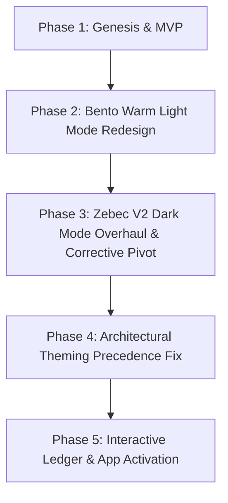

# BudgetFit: Comprehensive Project History, Architectural Analysis & Regression Prevention Guide

This document serves as the authoritative architectural record and historical analysis for the **BudgetFit** JavaFX fintech application. It details the project's evolution from a basic desktop MVP to an enterprise-grade financial dashboard featuring dual-theme design systems (Bento Warm Light Mode & Zebec V2 Dark Luxury) and fully interactive mock data persistence.

---

## 1. Project Timeline & Story



### Phase 1: Genesis & Basic Desktop MVP
- **Concept**: A standalone desktop financial planning and budgeting tool built on Java 17, JavaFX 17, and Maven.
- **Foundation**: Established SQLite (`budgetfit.db`) as the persistent mock database layer using JDBC (`sqlite-jdbc`). Created core DAOs (`TransactionDAO`, `UserDAO`) and base FXML layouts (`dashboard.fxml`, `atm.fxml`, `investments.fxml`, `admin.fxml`).
- **Initial State**: Standard JavaFX UI controls (Modena theme), basic table views, and separate window controllers.

### Phase 2: Bento Warm Light Mode Redesign
- **Objective**: Modernize the UI to match top-tier fintech web platforms (e.g., Spenmo, Ramp Enterprise, Apple Card) with a clean, welcoming, high-fidelity light aesthetic.
- **Implementation**:
  - Introduced a curated HSL color token system in `styles.css` (`--bf-bg-page: #faf7f2`, `--bf-bg-card: #ffffff`, `--bf-amber-400: #EF9F27`, `--bf-green: #2d9d6e`).
  - Stripped default JavaFX chart chrome (hiding axis lines, tick marks, and legends) in favor of custom UI overlays, bento-box stat containers (`.bento-stat-card`), and dynamic SVG sparklines (`SVGPath`).
  - Refactored `DashboardController` into a centralized navigation hub managing a dynamic `StackPane` (`contentArea`) with a smooth, collapsible left navigation sidebar (`handleToggleMenu()`).

### Phase 3: Zebec V2 Dark Mode Overhaul & Corrective Pivot
- **Objective**: Implement a premium, site-wide "Zebec V2" dark luxury aesthetic (deep charcoal `#0b0f19` backgrounds, dark slate `#111827` cards, emerald `#10b981` highlights) triggered by a theme toggle.
- **The Problem**: Toggling dark mode initially only turned input boxes black. During an early attempt to overhaul the dark theme, `atm.fxml` was accidentally hardcoded to dark mode by default.
- **The Corrective Pivot**: We executed a strategic pivot to restore `atm.fxml` back to the pristine Bento Warm light mode default, ensuring structural parity while reserving the dark luxury palette strictly for the runtime override stylesheet (`dark-theme.css`).

### Phase 4: Architectural Theming Precedence Fix
- **The Problem ("Doesnt work at all")**: Toggling the dark mode checkbox added `dark-theme.css` to the `Scene`, but child views (`atm.fxml`, `dashboard.fxml`, `savings.fxml`) remained stubbornly in light mode.
- **Root Cause Discovery**: In the JavaFX CSS specification, stylesheets attached directly to child `Parent` containers (`stylesheets="@/css/styles.css"`) take higher precedence than stylesheets attached to the root `Scene`.
- **The Fix**: Supercharged `DashboardController.handleThemeToggle()` and `switchView()` to dynamically inject `dark-theme.css` directly into `scene`, `mainPane`, AND every child `Parent` node inside `contentArea`.

### Phase 5: Interactive Ledger & App Activation
- **Objective**: Transform static UI placeholders into a fully interactive, living application ("make the app come alive").
- **Implementation**: 
  - Converted static category tabs (`All`, `Income`, `Expenses`, `Bills`, `Savings`, `Debt`) into clickable filters that dynamically update `ledgerTable` via `TransactionDAO`.
  - Added live sorting (`Date`), interactive JavaFX `ChoiceDialog` filters (`Type`, `Category`), real-time text searching (`Sender / Receiver`), and pre-populated `TextInputDialog` prompts (`Edit Bill`) that persist updates back to SQLite and immediately refresh the UI.

---

## 2. Key Architectural Decisions & Pivots

### Dual-Path Styling System
Instead of maintaining separate FXML files for light and dark modes, BudgetFit utilizes a unified FXML structure paired with a dual-path CSS architecture:
1. **Base (`styles.css`)**: Defines structural layout rules, typography scales (DM Sans, DM Serif Display, JetBrains Mono), padding tokens, and default Bento Warm light mode colors.
2. **Master Override (`dark-theme.css`)**: Contains purely color and border override rules. When injected at the container level, it cleanly replaces background fills, text fills, and border accents without altering layout geometry.

### Decoupling Structure from Theme Tokens
During the ATM light mode restoration, cards appeared squished because the `.card` class lacked padding (previously bundled inside `.card-dark`). 
- **Architectural Rule**: Layout geometry (padding, margins, spacing) must be decoupled from theme color classes. Introduced `.card-padded { -fx-padding: 24; }` and `.sub-card` to ensure containers maintain perfect dimensions regardless of the active color theme.

---

## 3. Technical Challenges, Pitfalls & Regression Prevention

### 1. JavaFX CSS Hierarchy & Precedence Traps
- **Pitfall**: Adding a theme stylesheet to `scene.getStylesheets().add(...)` will fail to style child FXML files if those files declare `stylesheets="@/css/styles.css"` on their root nodes.
- **Prevention**: Always broadcast dynamic stylesheet changes across the scene graph hierarchy. When loading new sub-views in `switchView()`, explicitly check the state of the theme toggle (`darkModeBox.isSelected()`) and attach the override stylesheet to the newly loaded `Parent` node before rendering.

### 2. FXMLLoader Exceptions & Attribute Mismatches
- **Pitfall**: Using CSS shorthands or web-based attributes in FXML (e.g., `-fx-margin`, `prefWidth="MAX_VALUE"`) causes fatal `LoadException`s during `FXMLLoader.load()`.
- **Prevention**: FXML is strictly typed against the JavaFX API. 
  - Use `maxWidth="Infinity"` instead of `MAX_VALUE`.
  - Use `HBox.hgrow="ALWAYS"` or `VBox.margin` instead of CSS margin properties.
  - Always verify UI structural changes with `mvnw clean compile` and run the application to validate FXML parsing.

### 3. XML Syntax Corruption
- **Pitfall**: Manual edits to FXML files can occasionally introduce stray characters (e.g., `</HBox>*`), resulting in fatal `SAXParseException`s at runtime.
- **Prevention**: Maintain strict XML compliance. Utilize IDE XML validators and ensure closing tags are pristine before running Maven builds.

### 4. Redundant UI Data Formatting
- **Pitfall**: Hardcoding static decimal labels (e.g., `.02213`) next to dynamic currency labels (`$4,000.00`) creates broken, unformatted strings (`$4,000.00.02213`) when backend formatters update.
- **Prevention**: Rely entirely on Java `NumberFormat` or custom cell factories (`TableCell`) for currency formatting. Eliminate static decimal decorations in FXML to preserve data presentation integrity.

---

## 4. Module Inventory & Controller Mapping

| View / FXML | Controller | Primary Responsibilities |
| :--- | :--- | :--- |
| `dashboard.fxml` | `DashboardController` | Central navigation hub, top-level StackPane (`contentArea`), theme toggle broadcasting, currency/month selection, and the full Transaction Ledger view. |
| `atm.fxml` | `AtmController` | Deposited balance metrics, active/external account summaries, recent transactions bento boxes, and P2P/Deposit/Withdrawal action forms. |
| `investments.fxml` | `InvestmentController` | Stock/crypto market simulation, portfolio holdings table, buy/sell transaction processing, and dynamic balance variance tracking. |
| `trends.fxml` | `TrendsController` | Advanced financial analytics, category breakdown charts, and income vs. expense visual trends. |
| `admin.fxml` | `AdminController` | System administration, user session management, audit log inspection, and global system status overrides. |

---

## 5. Verification & Testing Protocol

To verify the integrity of the codebase after any structural or styling modifications, execute the following protocol:

1. **Clean Compilation**:
   ```powershell
   .\mvnw.cmd clean compile
   ```
   *Ensures all Java controllers, DAOs, and FXML constants compile without syntax or type errors.*

2. **Runtime Verification**:
   ```powershell
   .\run.bat
   ```
   *Launches the application. Verify that `FXMLLoader` parses all views without throwing `LoadException` or `SAXParseException` in the terminal.*

3. **Theme Integrity Check**:
   - Click the **Dark Mode** toggle in the bottom-left sidebar.
   - Navigate through **ATM**, **Budget**, **Savings**, **Investments**, and **Ledger** tabs.
   - Verify that all backgrounds shift to `#0b0f19`, cards shift to `#111827`, and text shifts to white/grey across every single screen.

4. **Interactive Functional Check**:
   - Open the **Transaction Ledger** view.
   - Click the **Income**, **Expenses**, and **Bills** tabs to verify real-time table filtering.
   - Click **Edit Bill** on a selected transaction, update the description, and verify that the table immediately displays the saved changes.
